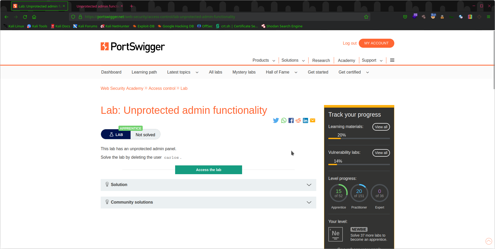
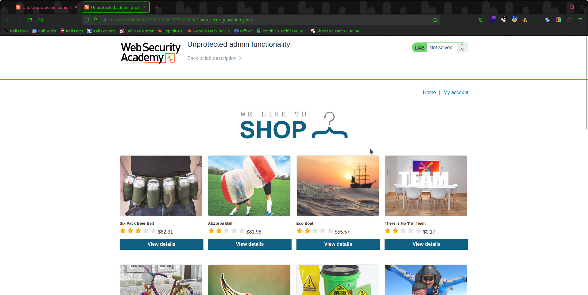
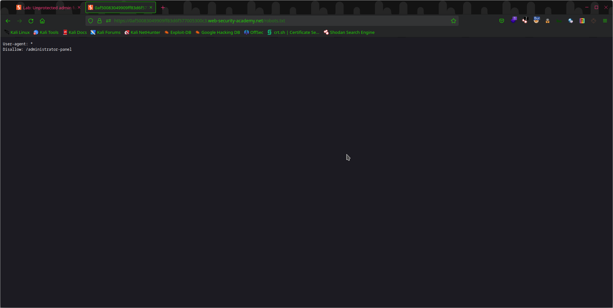
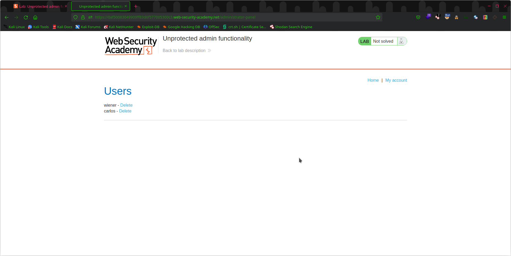
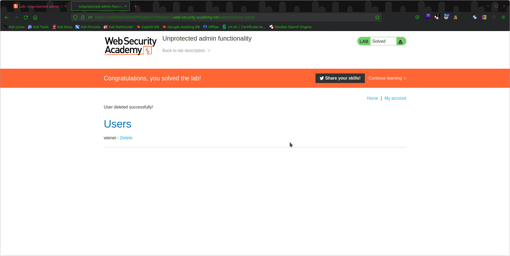

# Lab: Unprotected Admin Functionality

This lab is designed to help you understand the risks associated with unprotected admin functionality in a web application. In this lab, you will exploit a web application with unprotected admin functionality and learn how to mitigate these risks.

## Objective
Access the unprotected `admin panel` and delete  `carlos` account

## Steps Taken

1. Start by analyzing the web page for any login portals

3. None found
4. We can always search for robots.txt directory to see the sitemap 
[Note: robots.txt directory is different from sitemap.xml but it's just there are urls defined as allowed or dissallowed so no harm looking in it]

5. Jackpot! `/administrator-panel` well it says disallowed

6. Here we are at the admin panel.

7. Delete carlos and lab-solved

# Peace!
