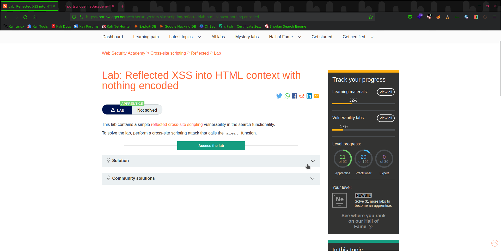

# Lab:Reflected XSS into HTML context with nothing encoded

There is some vulnerable parameter which can be controlled by the user and what do we do when we find a vulnerable parameter we exploit it

## Objective 

Exploit the search parameter for a alert box

## Steps taken

1. Type some rubbish in search param and see if it's reflected
2. It is now send your specially handpicked payload
3. `rubbish">` and now you can feel like you are a hemker
4. Lab-solved folks

# Peace

