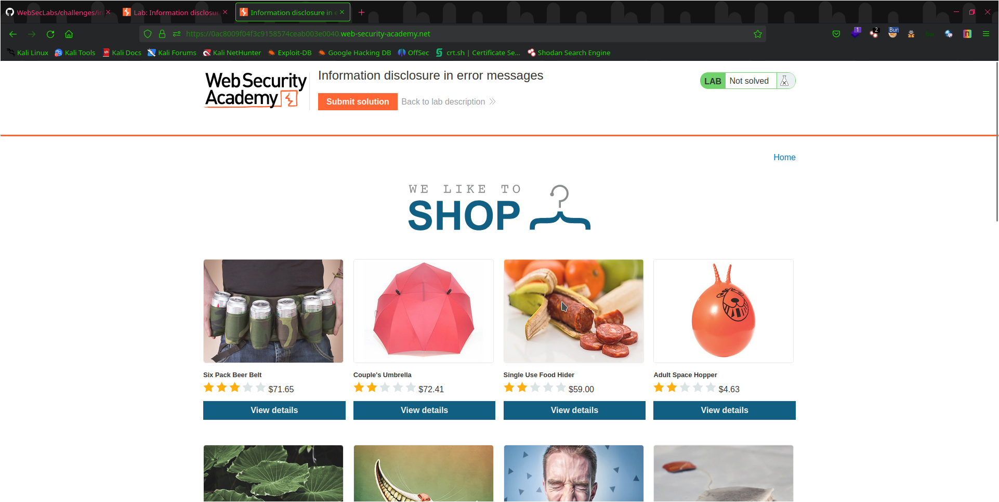
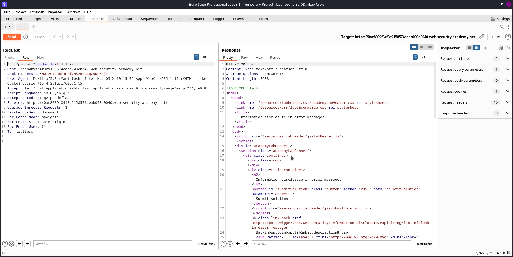
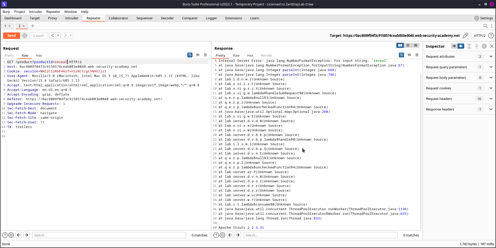
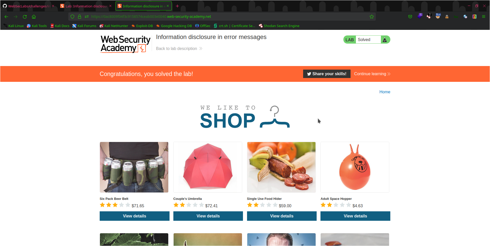

# Lab: Information Disclosure Through Error Messages

This is a lab designed to teach you about the risks of information disclosure in error messages and how to prevent them in a vulnerable web application. In this lab, you will be exploiting a vulnerable web application to extract sensitive information from error messages.

## Steps Taken
---------------------
1. Start by Analyzing the WebAPP
   
2. WebApp dosen't seem much interactive but if you look at requests in burp proxy you will find a `productid=` when you select view detail for any product
   
3. Basically these `productid=` should betreated as numerical digits and sending any non-integer string may break the program
4. In my case `productid=1` i changed it to `productid=reveal` you se ##### Abra ka Dabra
   
5. You will find the vulnerable version number in the response
6. Submit version number and you have Successfully Completed this lab!
   

## Conclusion
Congratualtions You have Completed this lab and learned about the risks of information disclosur in error messages

### Thank You For Reading my Review.!

# Peace
