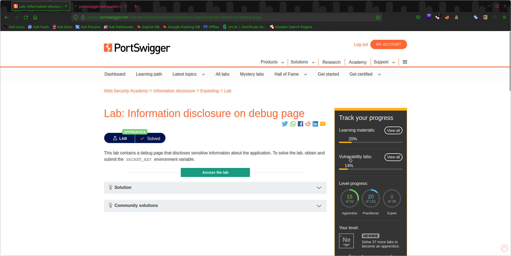
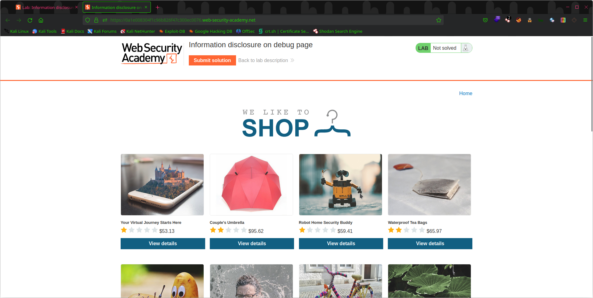
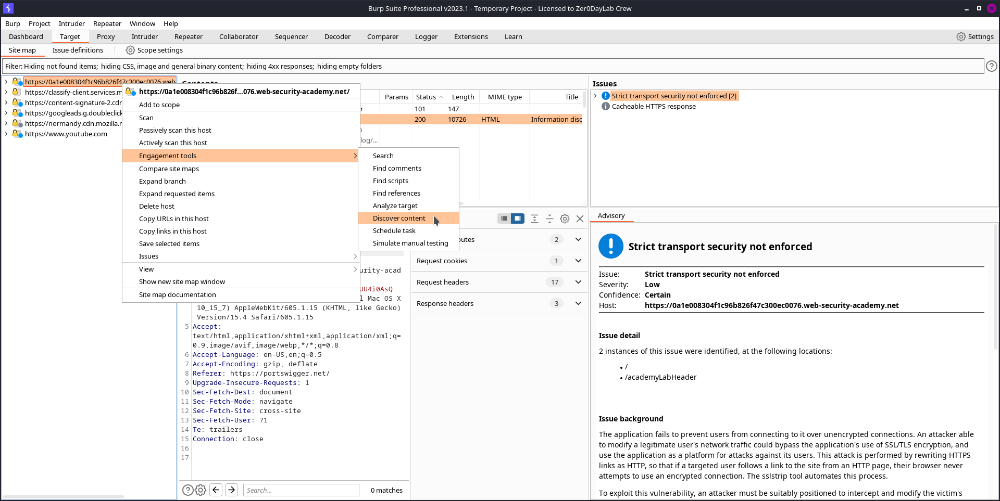
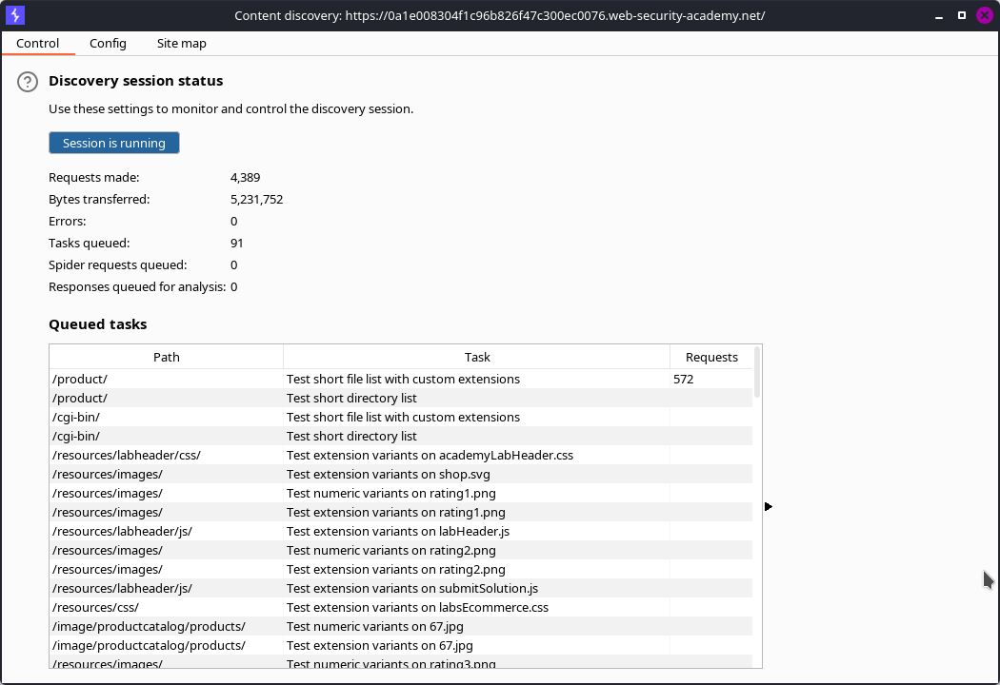
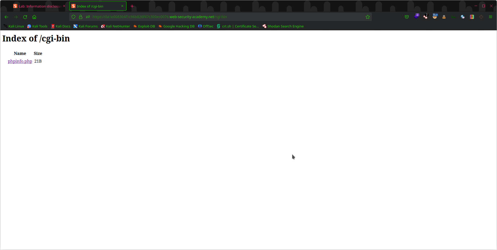
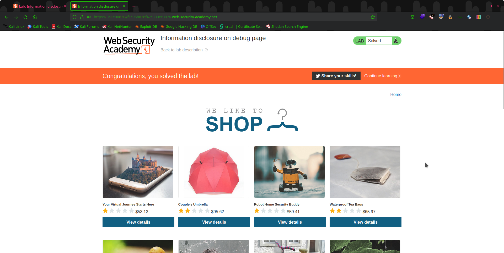

# WebSecLabs - Information Disclosure Lab - Solution

In this readme file, I will explain how I solved the Information Disclosure Lab in the WebSecLabs repository. The objective of this lab is to learn how to identify and exploit information disclosure vulnerabilities on a web application.

## Lab Objective

The lab is designed to help users understand how information disclosure vulnerabilities can be exploited to reveal sensitive information about a web application. In this lab, the objective is to identify and exploit an information disclosure vulnerability to gain access to sensitive data on the web application.

## Steps

I approached this lab by following the step-by-step instructions provided in the `readme.md` file in the `information disclosure` subdirectory of the `Challenges` directory. The following are the steps I took to complete this lab:

1. Start By Analyzing The WebAPP
   
2. Discription says there is a `Debug Page` somewhere which contains a secret key
3. We can use burp `content discovery` tool `Burp -> Target -> Right click target -> Engagement tools -> Content Discovery`
   
4. Found a `/cgi-bin` directory
   
5. Found the info-page 
   
6. use `Ctrl + f` and search for secret_key there you will get it
7. Verify Lab Solved
   

## Conclusion

Through this lab, I learned how information disclosure vulnerabilities can be exploited to reveal sensitive data on a web application. I also learned how to use various tools and techniques to identify and exploit these vulnerabilities, including using browser developer tools, Burp Suite, and command-line utilities.

Overall, this lab was an excellent learning experience, and I would highly recommend it to anyone looking to improve their web application security skills.
