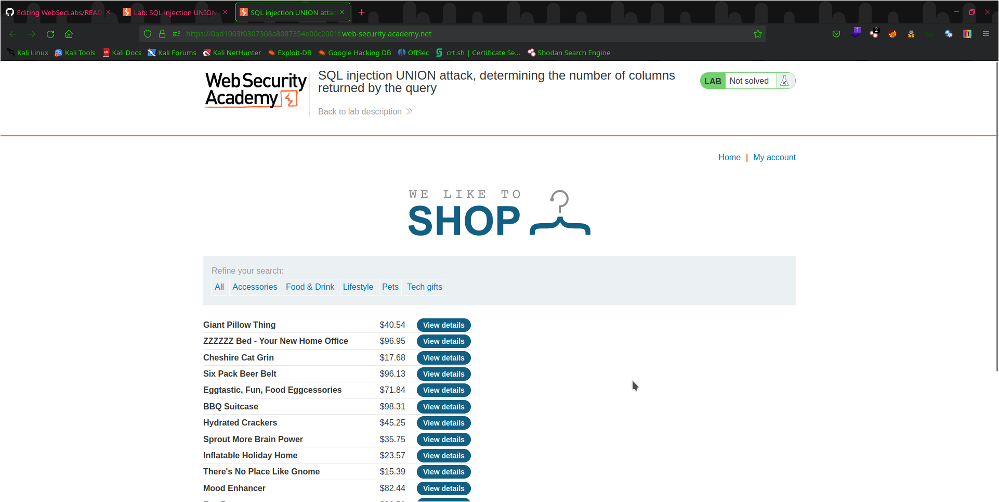
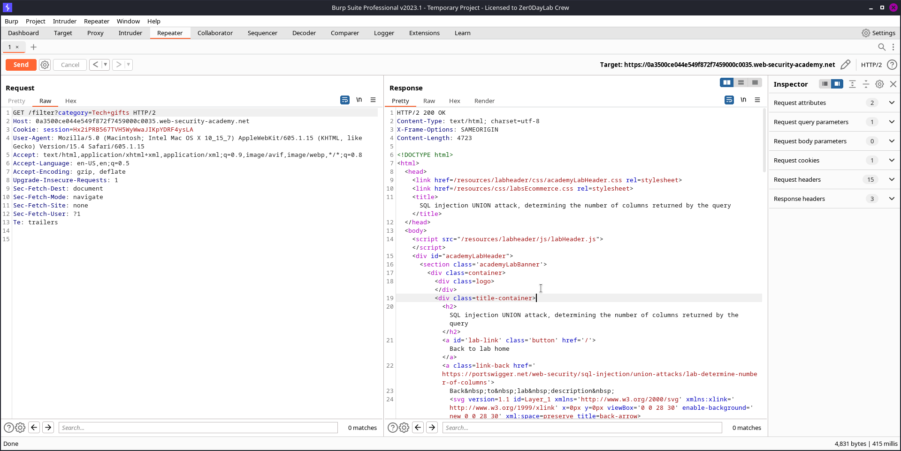
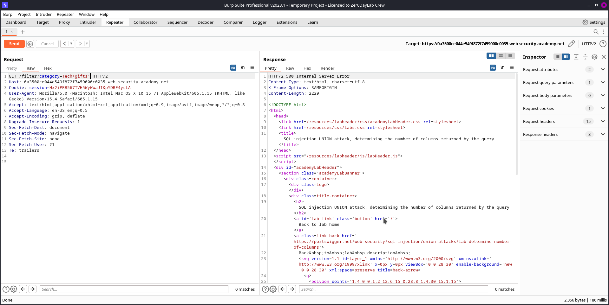
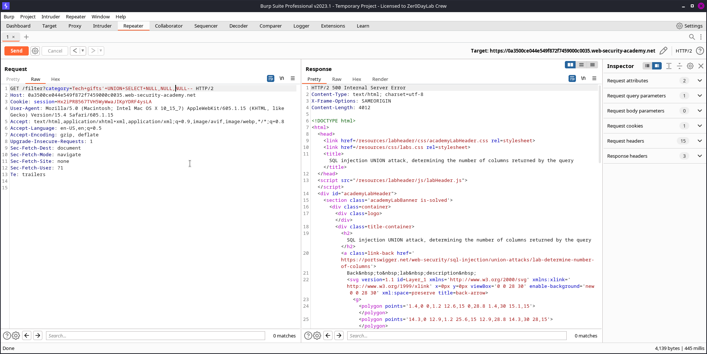
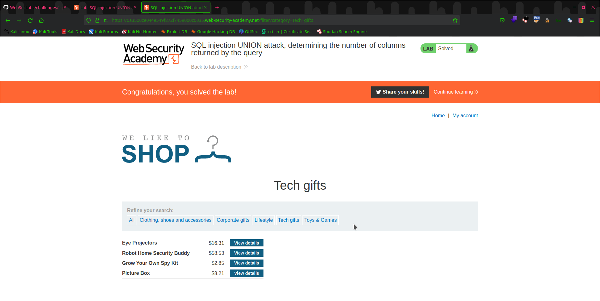

# Lab 3: SQL Injection UNION Attack, Determining the Number of Columns Returned by the Query

This lab demonstrates a SQL injection vulnerability that allows an attacker to perform a UNION attack and determine the number of columns returned by the query.

## Objective

The objective of this lab is to exploit the SQL injection vulnerability to perform a UNION attack and determine the number of columns returned by the query.

## Steps Taken

To complete this lab, I followed the following steps:

1. Analyzed the web application to identify the vulnerable parameter.
   
   

2. Used a web proxy tool to intercept the request and modified the parameter with a single quote (') to check for SQL injection vulnerabilities.

   

3. Found that the vulnerable parameter was indeed susceptible to SQL injection.

   

4. Performed a UNION attack to determine the number of columns returned by the query by injecting the `UNION SELECT NULL, NULL, NULL` statement.

   

6. Verified that I was able to retrieve data from the database by injecting a `UNION SELECT` statement with valid data and the correct number of columns.

   

## Conclusion

Through completing this lab, I gained practical experience in identifying and exploiting SQL injection vulnerabilities using a UNION attack to determine the number of columns returned by the query. I am confident that the skills I acquired will enable me to contribute to any organization's security efforts.

Thank you for reviewing my completed lab!

