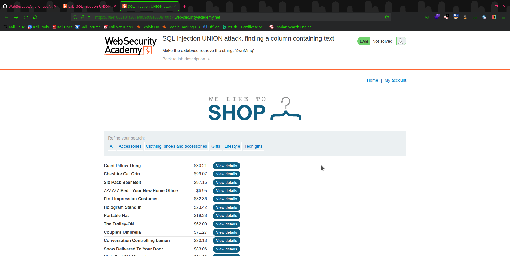
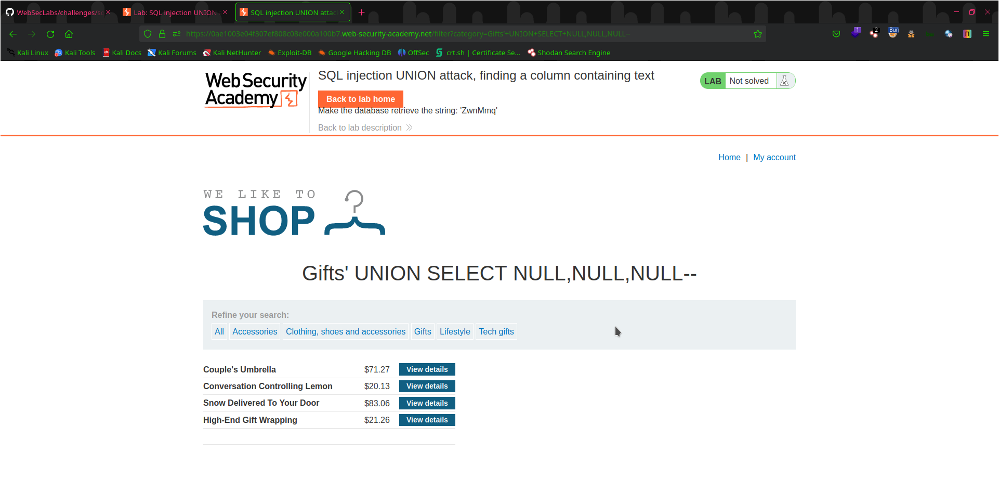
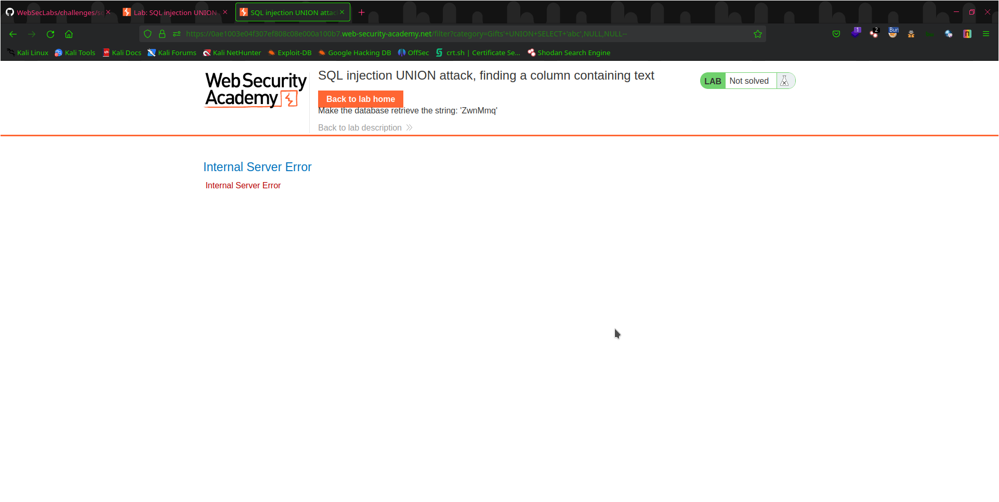
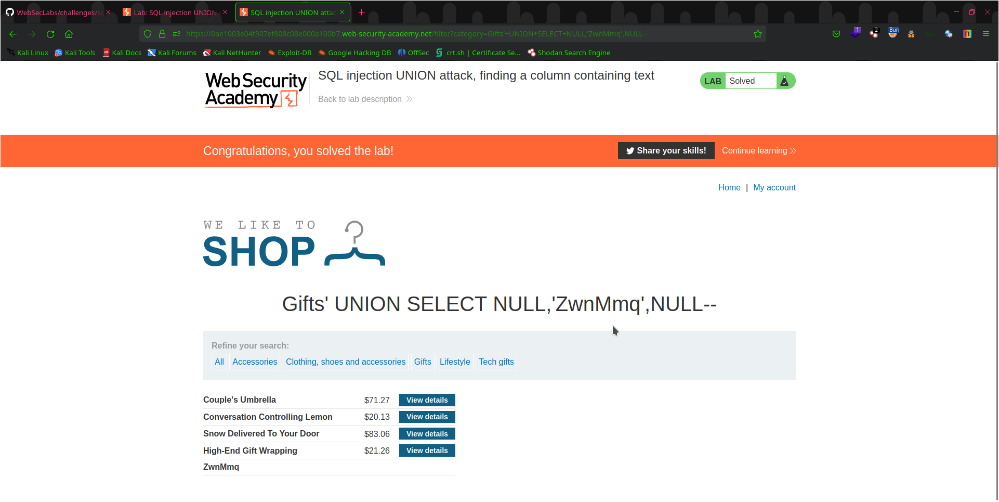

# Lab: SQL Injection UNION Attack, Finding a Column Containing Text
This is a lab designed to teach you about SQL injection UNION attacks and how to find a column containing text in a vulnerable web application. In this lab, you will be using SQL injection techniques to retrieve information from a vulnerable web application and find the name of a column containing text.

## Steps Taken
-----------------------
1. Start by analyzing the webapp
   
   
2. As per the lab discription the product category filter is vulnerable so i chose `Gifts` as my vuln parameter
   

3. Now i just have to find the number of columns on through this parameter
4. Simply use command `'+UNION+SELECT+NULL,NULL,NULL--` right after where URL ends
   
   
   `{Note: Number you have to use NULL in increasing order in order to identify the number of colummns if you don't get it using NULL one time increase it, it took me 3 NULLS which means 3 columns exist
           on this page}
  
5. Now in order to make the webapp show us a  string we need to give that string in these columns until server gives out the output
    
    
6. change the location of `'abc'` to another slot replacing the `NULL` to see which column responds `{Change abc to whatever string you have been asked to print}
7. Now verify that lab is solved
    
    
    
### Conclusion
-----------------------------
By completing this lab i have gained knowledge and expiriece in indentifying and exploiting SQL vulnerability using UNION method
