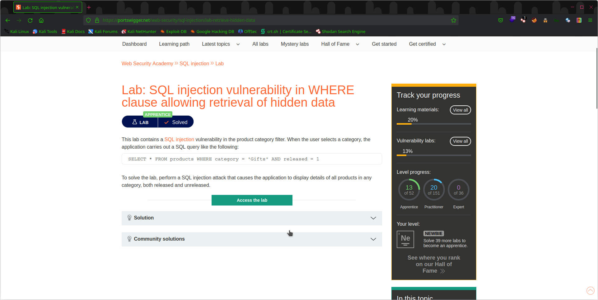
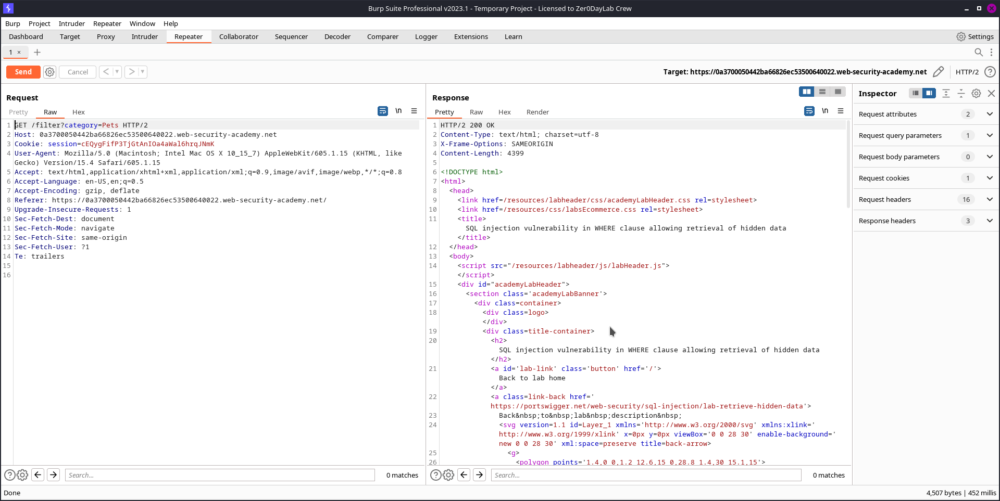
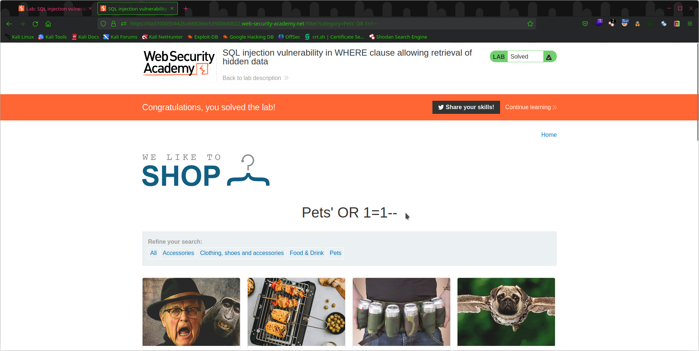

# Lab 1: SQL Injection Vulnerability in WHERE Clause

This lab demonstrates a common SQL injection vulnerability in the WHERE clause of a database query. The vulnerability allows an attacker to retrieve hidden data that they should not have access to.

## Objective

The objective of this lab is to retrieve hidden data from the database by exploiting a SQL injection vulnerability in the WHERE clause of a database query.

## Steps Taken

To complete this lab, I followed the following steps:
   
   

1. Analyzed the web application to identify the vulnerable parameter.

2. Used a web proxy tool to intercept the request and modified the parameter with a single quote (') to check for SQL injection vulnerabilities.

3. Found that the vulnerable parameter was indeed susceptible to SQL injection.
   
4. Exploited the SQL injection vulnerability by injecting the `1=1` statement in the WHERE clause to bypass authentication and retrieve hidden data.

   

5. Verified that I was able to retrieve the hidden data by checking the server's response.

   

## Conclusion

Through completing this lab, I gained practical experience in identifying and exploiting SQL injection vulnerabilities in the WHERE clause of a database query. I am confident that the skills I acquired will enable me to contribute to any organization's security efforts.

Thank you for reviewing my completed lab!
