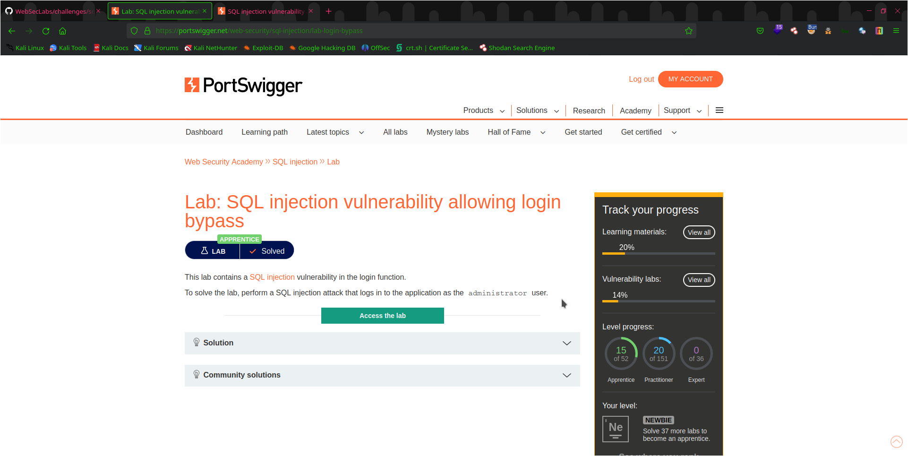
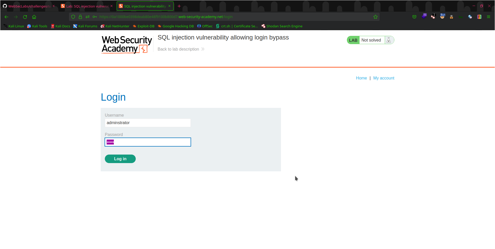
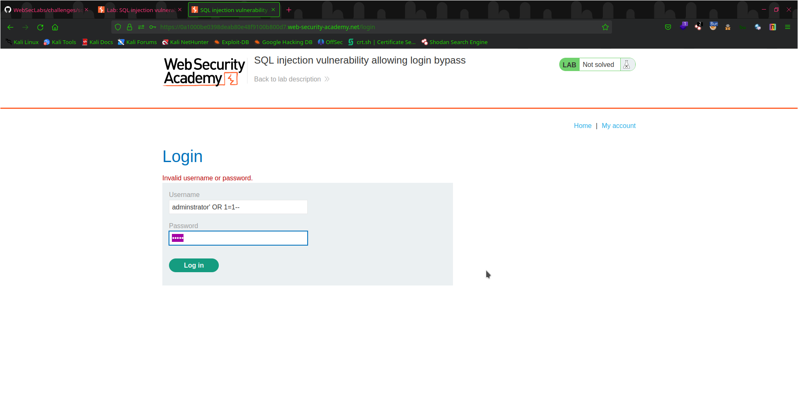

# Lab 2: SQL Injection Vulnerability Allowing Login Bypass

This lab demonstrates a SQL injection vulnerability that allows an attacker to bypass authentication and gain access to a protected area of the web application.

## Objective

The objective of this lab is to exploit the SQL injection vulnerability to bypass the authentication mechanism and gain access to a protected area of the web application.

## Steps Taken

To complete this lab, I followed the following steps:

   

1. This lab is vulnerable in the login form as described in lab discription
    
    
    
2. Use `username: administrator` `password: admin` this will cause a error because of incorrrect password

3. Modify the `username: adminstrator` to `username: administrator' OR 1=1--`

     
     
     This will make everything after the username a comment which means whatever password you provide it dosen't matter and webapp will be forced to login      as administrator without password

5. Verified that I was able to access the protected area by checking the server's response.

     

## Conclusion

Through completing this lab, I gained practical experience in identifying and exploiting SQL injection vulnerabilities that allow login bypass in web applications. I am confident that the skills I acquired will enable me to contribute to any organization's security efforts.

Thank you for reviewing my completed lab!

In this example, the screenshots are included inline with the steps they correspond to, making it easier for readers to see the relevant screenshots as they go through the lab. The screenshots are stored in the "screenshots" subdirectory and are referenced using their file paths. You can replace the screenshots and steps with your own for Lab 2.
